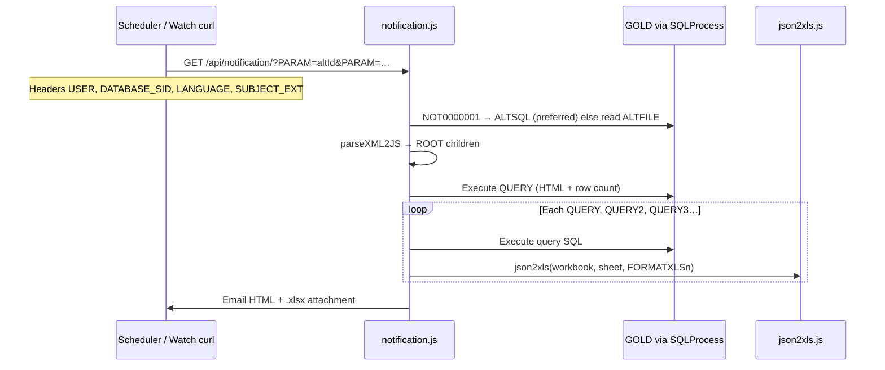

# Alerts engine

## Overview

Classic ICR alerts are **XML-defined queries** (worksheets, conditional Excel rules) plus scheduler/email integration — separate from Supply Chain AI data health (`AI_DATA_CHECK_*`).

### Where definitions are stored

| Source | `ALERTS` column | Priority at runtime | Maintenance |
|--------|-----------------|---------------------|-------------|
| **ICR database (preferred)** | `ALTSQL` — full `<ROOT>` document as CLOB | Used when `ALTSQL` is not null/empty | **Alerts management** (`/alerts-icr`): *SQL Query & Formatting (XML)* |
| **Server filesystem (legacy)** | `ALTFILE` — absolute or app path to one `.xml` file | Used only if `ALTSQL` is empty | Same UI (**File** button) or direct edit under `controlRoom_server/server/alerts/` |

`notification.js` implements: **if `alertData[0].ALTSQL` → parse from DB; else if `alertData[0].ALTFILE` → `fs.readFile`**. Distribution metadata (emails, subject, realtime flag, margins, freeze, etc.) always comes from the **`ALERTS`** row via **`NOT0000001`** — not from the XML file.

**Code paths:**

| Module | Role |
|--------|------|
| `controlRoom_server/server/server/controller/notification.js` | `GET /api/notification/` — load `ALTSQL` or `ALTFILE`, parse XML, run SQL, build email + workbook |
| `controlRoom_server/server/server/utils/json2xls.js` | ExcelJS table at **A5**, header rows 1–4, `formatXLS()`, optional `preFilter` OOXML injection |
| `controlRoom_client/.../alerts.icr.component.ts` | CRUD on `ALERTS`; primary editor for `ALTSQL`; file helper when `ALTFILE` is set |
| `controlRoom_server/server/alerts/*.xml` | Optional on-disk copies (e.g. `BELOW_XDAYS.xml`, `FCST_ZERO.xml`, `LOS_ATTRI_MOVEMENT.xml`) — query logic and `<FORMATXLS>` only; thresholds and recipients stay on the DB row |

**LIBQUERY:** `NOT0000001` — load alert metadata (subject, emails, `ALTSQL`, `ALTFILE`, print flags).

---

## End-to-end flow



1. **`processContent`** scans `result.ROOT` for keys matching `QUERY`, `QUERY2`, `QUERY3`, … and builds **query nodes** (SQL, sheet name, format JSON, tab color, freeze tags).
2. **`processDetailandXLS`** runs **`ROOT.QUERY`** first for **`detailData`** (email HTML table and `[N Object(s)]` in subject).
3. For **each** query node (including the first), it adds a worksheet, runs that SQL, and calls **`json2xls.json2xls(..., qNode.sheetFormat, ...)`**.
4. Workbook is written with **`writeBufferWithFilters`** when `preFilter` is configured (native Excel dropdown filters without hiding rows).

---

## XML document structure (`<ROOT>`)

XML is parsed with **`xml2js`** — identical whether the string came from **`ALTSQL`** or a file referenced by **`ALTFILE`**. All children are optional except at least one **`<QUERY>`**.

### Query blocks (one or many worksheets)

| Element | Required | Consumed by | Description |
|---------|----------|-------------|-------------|
| `<QUERY>` | Yes (first sheet) | `notification.js` | Primary SQL. Drives **email HTML** and first Excel sheet. |
| `<QUERY2>`, `<QUERY3>`, … | No | `notification.js` | Additional sheets; discovered by regex `^QUERY(\d*)$`. |
| `<NAME>` | No | `notification.js` | Tab title for `QUERY` (default `RESULT1`). |
| `<NAME2>`, `<NAME3>`, … | No | `notification.js` | Tab title paired with `QUERY2`, `QUERY3`, … |
| `<FORMATXLS>` | No | `json2xls.js` | JSON string: conditional formatting + optional `preFilter`. |
| `<FORMATXLS2>`, … | No | `json2xls.js` | Format for sheet index 2, 3, … |
| `<TABCOLORXLS>` | No | `notification.js` | Worksheet tab ARGB hex (e.g. `BE2528`). Default `244062`. |
| `<TABCOLORXLS2>`, … | No | `notification.js` | Tab color per sheet index. |
| `<FREEZERHEADER>`, `<FREEZERHEADER2>`, … | No | Parsed into query node | Per-sheet freeze hint (alert-level `ALTFREEZEHEADER` on `ALERTS` row still applies globally). |
| `<FREEZERCOLUMN>`, `<FREEZERCOLUMN2>`, … | No | Parsed into query node | Column split for freeze. |

**SQL conventions:**

- Oracle SQL only; `@dblink` as in other ICR modules.
- Bind placeholders **`:param1`**, **`:param2`**, … map to **`PARAM`** query-string values** in order** (after the alert id):  
  `?PARAM=ALTID&PARAM=90061&PARAM=3` → `:param1` = `90061`, `:param2` = `3`.
- Column aliases in the SELECT list become **Excel column headers** (quoted identifiers preserved).
- A **recap** row pattern: first branch of `UNION` returns summary metrics and literal `'Recap'` in a **Notes** column; detail rows use `NULL` or blank in summary columns — conditional rules often target `$J5="Recap"` on row 5 (header area) or data row 6+.

### Optional banner and column rename

| Element | Consumed by | Description |
|---------|-------------|-------------|
| `<BANNER>` | `notification.js` | Separate SQL executed before main processing; result passed into Excel/HTML context. |
| `<RENAME>` | `notification.js` | SQL returning `RENAMECOL` (column letter) + `COLNAME` — renames headers before `addTable`. |

### Subject-line documentation (not parsed by Node)

| Element | Used by engine? | Purpose |
|---------|-----------------|---------|
| `<HEADER>` | No | Human-readable suffix when the report **has rows** — copy into curl **`SUBJECT_EXT`** in scheduler scripts. |
| `<HEADERIFEMPTY>` | No | Suggested subject suffix when **zero rows** (email still sent for non-realtime alerts with empty body). |

Email subject at send time:

```text
{ALTSUBJECT} {SUBJECT_EXT} [{detailData.length} Object(s)]
```

`SUBJECT_EXT` comes from the HTTP header, not from `<HEADER>` automatically.

### Reference copies on disk (`server/alerts/`)

These files are **not required** when the same XML is in **`ALTSQL`**. They remain useful as repo history, diff-friendly backups, or for alerts that still point `ALTFILE` at a deployed path.

| File | Sheets | Notes |
|------|--------|-------|
| `WHS_FILL_RATE_CAT.xml` | `QUERY` + `QUERY2` | Fill rate by category and by category/vendor; recap row; `HEADER` / `HEADERIFEMPTY` |
| `FILLRATE_RECEPTION.xml` | Single `QUERY` | Reception fill rate variant |
| `BELOW_XDAYS.xml`, `FCST_ZERO.xml`, `LOS_ATTRI_MOVEMENT.xml`, … | Varies | Long-standing operational monitors |
| Mass-update journal `<ROOT>` (embedded in UI) | `QUERY` … `QUERY5` + `FORMATXLS` … `FORMATXLS5` | Multi-sheet holes report with per-sheet formatting |

**Fill rate + conditional formatting (structural excerpt)** — matches the warehouse GWR pattern (full SQL in repo XML or `ALTSQL`):

```xml
<ROOT>
  <TABCOLORXLS>BE2528</TABCOLORXLS>
  <QUERY> … UNION … 'Recap' "Notes" … </QUERY>
  <FORMATXLS>{ "conditionalRule": [ … ] }</FORMATXLS>
  <NAME2>Fill rate by Cat. Vendor</NAME2>
  <QUERY2> … </QUERY2>
  <HEADER>Warehouse fill rate by cat</HEADER>
  <HEADERIFEMPTY>No Warehouse fill rate by cat</HEADERIFEMPTY>
</ROOT>
```

---

## Excel layout (`json2xls.js`)

| Constant / row | Content |
|----------------|---------|
| `TABLE_HEADER = 4` | Rows 1–4: branded header (title, `ALTSUBJECT` + `SUBJECT_EXT`, alert id, date) |
| Row 5 (`A5`) | Table header row (`addTable`, `headerRow: true`, `totalsRow: true`) |
| Row 6+ | Data rows from query result |

If **`detailData.length === 0`**, cell `A6` shows **No reported elements** (no table).

**Alert row flags** (not in XML): `ALTORIENTATION`, `ALTMARGIN`, `ALTFITPAGE`, `ALTFREEZEHEADER`, `ALTFREEZECOLUMN`, `ALTXLSBREAK`, `ALTCOLMOVE`, `ALTTITLEXLS`, `ALTBORDER`, etc.

---

## `FORMATXLS` JSON schema

Stored as a **string** inside `<FORMATXLS>` (or `FORMATXLS2`, …). Parsed with `JSON.parse` after stripping a trailing `}null` artifact if present.

### Top-level keys

| Key | Type | Handler |
|-----|------|---------|
| `conditionalRule` | array | `formatXLS()` → ExcelJS conditional formatting + direct cell styles |
| `preFilter` | array | `resolvePreFilters()` + `writeBufferWithFilters()` — injects native `<autoFilter>` into sheet XML |

### `conditionalRule[]` entries

Each entry may include:

| Property | Description |
|----------|-------------|
| `easeRule` | **Range** for the rule (see below). |
| `style` | Direct cell styling (not CF XML): `numFmt`, `alignment`, `font`, `fill` — applied row-by-row in the range. |
| `rules` | Array of `{ ref, rule[] }` for Excel conditional formatting. |

**`easeRule` fields:**

| Field | Values | Meaning |
|-------|--------|---------|
| `repeat` | `"1"` or `"0"` | `"1"`: apply from `lineStart` through all data rows (+ header offset). `"0"`: fixed block (use explicit `ref` in `rules`). |
| `lineStart` | number (string) | First Excel row (e.g. `5` = header band, `6` = first data row). |
| `lineStop` | optional | Cap row when `repeat` is `"1"`. |
| `every` | number | Row step (usually `1`). |
| `columnStart` / `columnEnd` | Excel letters | Column range (`A` … `AD`). |

**`rules[].rule[]` types (processed in order):**

| Rule shape | Effect |
|------------|--------|
| `formulae` + `type: "expression"` | Single CF entry on static `ref` (e.g. `$J5="Recap"`). Deduped so formulae are not repeated per row. |
| `type: "containsText"` + `operator` + `text` + `style` | Text rules (e.g. `-` → red, non-blank → green) on **consolidated** range. |
| `cfvo` + `color` | Color scale / icon-style rules on consolidated range. |

**Example behaviors from fill-rate reports:**

- **Percent columns** — `style.numFmt: "0.00%"` on fill-rate / in-stock columns.
- **NS column** — red if cell contains `-`, green if not blank.
- **Recap row** — `expression` `$J5="Recap"` with bold font and green background on `A5:J99999`.
- **Status column** — priority-ordered `containsText` for `High`, `Medium`, `Low`, `Closed`, `Linked` (shared pattern across operational alerts).

### `preFilter` (optional)

```json
"preFilter": [
  { "columnName": "Dept.", "type": "value", "values": ["Grocery", "Dairy"] },
  { "columnName": "Hole date", "type": "today", "dateFormat": "MM/DD/RRRR" }
]
```

Multiple filters = **AND**; multiple `values` in one filter = **OR**. Requires caller to use **`writeBufferWithFilters(workbook)`** instead of raw `writeBuffer()` (already done in `notification.js`).

---

## HTTP API

### `GET /api/notification/?PARAM=…`

| Header | Role |
|--------|------|
| `USER` | SQL session user (typically `alert`) |
| `DATABASE_SID` | e.g. `HEINENS_CUSTOM_PROD` |
| `LANGUAGE` | e.g. `HN` |
| `SUBJECT_EXT` | Appended to `ALTSUBJECT` in subject and Excel title row |
| `FILENAME_EXT` | Attachment filename (default `result.xlsx`) |

Response body is empty string; delivery is **email** (and optional SMS on errors/spam guard).

### `GET /api/notification/1?PARAM=…`

Same load path but **`processContentNoHTML`** — query execution without HTML/email path (used for data export checks).

---

## UI screens

| Route | Component | Integration |
|-------|-----------|-------------|
| `/alerts-icr` | `alerts.icr.component.ts` | Manage definitions; **SQL Query & Formatting (XML)** textarea |
| `/alerts-journal` | `alert.journal.component.ts` | Run history |
| `/alerts-watch` | `watch.icr` | Watch configs; AWTSHELL curl template |
| `/reportfilter` | `report.filter.component.ts` | Filter/report linkage |

---

## `ALERTS` table (ICR app DB)

Each row is the **system of record** for scheduling and distribution. The **query + Excel XML** should live in **`ALTSQL`**; treat **`ALTFILE`** as an alternate loader only when `ALTSQL` is blank.

| Column group | Examples | In XML file? |
|--------------|----------|--------------|
| Identity / copy | `ALTID`, `ALTDESC`, `ALTSUBJECT`, `ALTCONTENT`, `ALTEMAIL`, `ALTEMAILCC`, `ALTREALTIME` | No — DB only |
| Query body | **`ALTSQL`** (`<ROOT>` …) | Yes — **preferred here** |
| Optional file path | **`ALTFILE`** → `…/server/alerts/SomeAlert.xml` | File holds query only if used |
| Excel print | `ALTORIENTATION`, `ALTMARGIN`, `ALTFREEZEHEADER`, `ALTFREEZECOLUMN`, `ALTXLSBREAK`, `ALTCOLMOVE`, … | No — DB only |
| Formatting in XML | `<FORMATXLS>` inside `ALTSQL` | Yes (not the separate `ALTFORMATXLS` UI field alone — engine reads `<FORMATXLS>` from parsed XML) |

---

## Coexistence with AI data health

| Classic alerts | AI data health |
|----------------|----------------|
| XML + ad hoc SQL | `AI_DATA_CHECK_DEF` + LIBQUERY count ids |
| Long-term ops monitors | Pipeline integrity + Investigate bridge |

Avoid duplicate business logic without ops agreement.

---

## Extension checklist

1. Author `<ROOT>` XML (test with `GET /api/notification/1` if needed).
2. **Save into `ALTSQL`** via **Alerts management** — preferred.
3. Optionally keep a copy under `server/alerts/` for git history; only set **`ALTFILE`** if you intentionally run from file with empty `ALTSQL`.
4. Set distribution, realtime, and print flags on the same `ALERTS` row.
5. Add scheduler curl with correct `PARAM` order and `SUBJECT_EXT`.
6. Document in [Functional alerts](functional/icr-standard/alerts.md).
